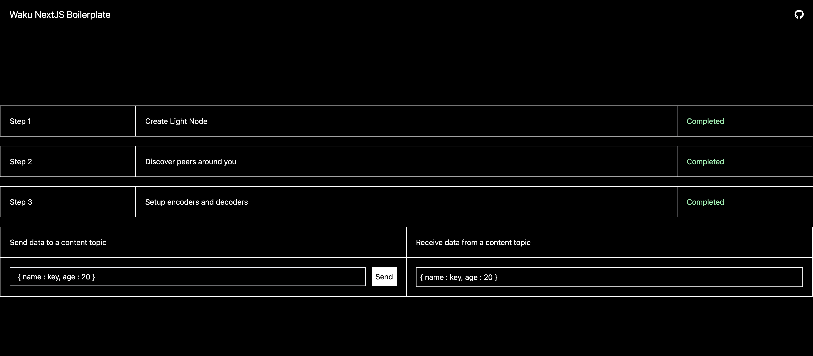

# Waku NextJS Boilerplate

This is a simple boilerplate for NextJS that demonstrates sending and receiving data with [Waku](https://waku.org). The protocols used in this boilerplate are : 
    - LightPush (sending data to a content topic)
    - Filter (retrieving data by subscribing to a content topic)
    - Store (persistance)

### What's included

The boilerplate has [TailwindCSS](https://tailwindcss.com/) already setup along with [react-icons](https://react-icons.github.io/react-icons/). NextJS version 14 is used.

### Future plans

Currently, the boilerplate connects to the bootstrap fleets and there might be issues in reliability and availability. To overcome these issues, you can either use your own federated set of Waku nodes or alternatively use [The Waku Network](https://docs.waku.org/learn/waku-network) which comes with a shared-node infrastructure that is expected to have better node availability, decentralised rate-limiting (RLN), auto-sharding and other amazing offerings that can make your Waku development journey simpler and efficient.